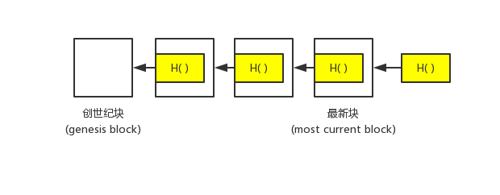

# 比特币的数据结构

在本节课中，会介绍比特币所运用到的两种主要的数据结构：区块链 (`Block Chain`)、默克尔树 (`Merkle Tree`)，这两种结构的基础都是哈希指针 (`Hash Pointer`)

## 哈希指针

**哈希指针 = 一般指针 + 哈希值**  
不严谨地说，一般的指针就是地址，是某一个结构在内存空间中的首地址。通过指针，可以找到相应的结构。哈希指针也有类似的作用，通过一个哈希指针可以找到其指向的区块。除此之外，哈希指针还包含其所指向的区块的哈希值，因此可以判断其指向的区块是否被篡改。

## 第一个数据结构：区块链

**Block chain , a linked list using hash pointers.**  
  
如上图所示，是一条简单的区块链。每个区块（除了创世纪块）都有一个哈希指针字段，通过此哈希指针可以找到上一个区块并验证其是否被篡改。另外，为了找到最新的区块，还需要指向其的一个哈希指针。  
可以看到，区块链其实就是我们所熟悉的链表，且新区块的插入是以头插法插入的。当然，与普通链表的最大不同在于，区块链所使用的是哈希指针。因此，区块链具有如下的性质：  
- 在网络上的某个结点，其无需保存自创世纪块以来的所有区块，只需保存近几个区块即可，然后在需要更多区块的时候再向其他结点请求。这是因为能通过哈希指针验证其他结点发来的区块是否被故意篡改。
- 仅通过指向最新块的哈希指针便可以判断自创世纪块开始，是否有区块被篡改。

## 第二个数据结构：Merkle树

**Merkle Tree, a binary tree using hash pointers.**  

在介绍Merkle树之前，我们先看一下区块链网络中结点的分类：  
.....